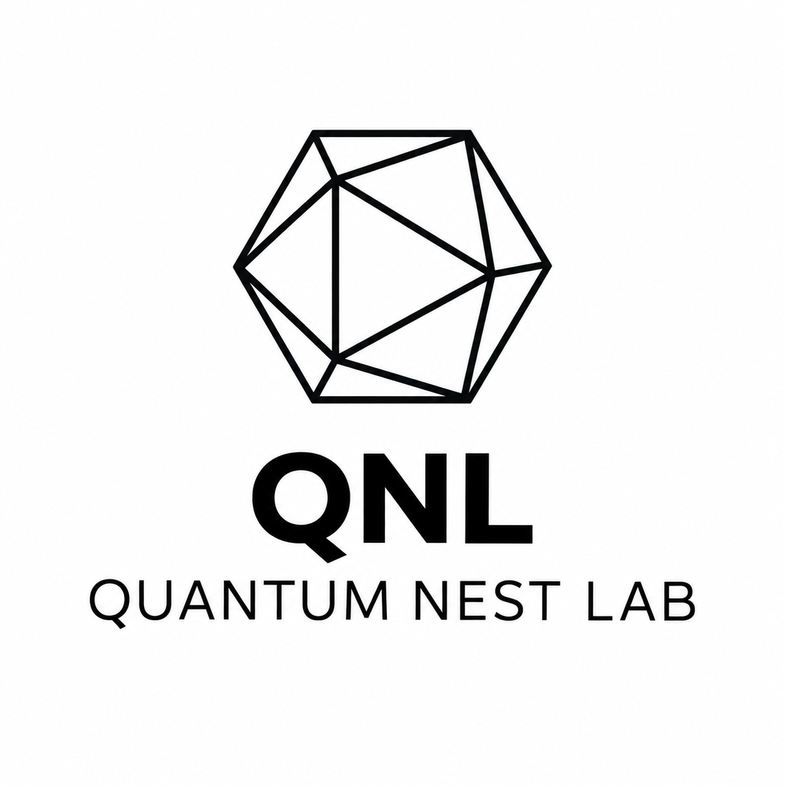

# QNL Command Centre

<p align="center"></p>
<p align="center">A workspace command centre for clients, projects, requirements, tasks, documents, finance, and team operations.</p>

## Overview

QNL Command Centre brings operational work into one workspace: client relationships, project delivery, requirements, tasks, documents, approvals, calendar activity, finance records, and workspace administration.

The repository contains a Next.js frontend and an Express/PostgreSQL backend.

## Features

- Workspace-scoped authentication and role-based access control
- Client, project, requirement, task, meeting, document, approval, and finance management
- Activity history, dashboard visibility, templates, line items, storage, integrations, and calendar reminders
- API and security integration test suites

## Application assets

<p align="center"></p>

The images above are application assets included in this repository.

## Tech stack

- Frontend: Next.js, React, TypeScript, pnpm
- Backend: Express, TypeScript, PostgreSQL
- Validation: TypeScript, ESLint, API integration tests, security integration tests

## Local development

Prerequisites: Node.js, pnpm, and Docker Desktop.

1. Copy `Frontend/.env.example` to `Frontend/.env.local` and provide a unique `SESSION_SECRET` of at least 32 characters.
2. Create the required backend environment file from its example.
3. Start PostgreSQL and apply migrations:

   ```sh
   cd Frontend
   pnpm db:up
   pnpm db:migrate:all
   ```

4. Start the frontend and backend in separate terminals:

   ```sh
   cd Frontend && pnpm dev
   cd Backend && pnpm dev
   ```

Create an account locally and complete company setup.

## Validation

```sh
cd Backend && pnpm db:test:setup
cd ../Frontend
pnpm typecheck
pnpm lint
pnpm build
pnpm test:api
pnpm test:security:next
```

## Security

Never commit `.env` files, database dumps, provider keys, session secrets, OAuth credentials, or production configuration. Use the supplied examples as templates and a suitable secret manager for real credentials.

## License

QNL Command Centre is source-available under the [QNL Command Centre Non-Commercial Source-Available License](./LICENSE.md).

You may view, download, modify, and use the software for personal, educational, research, and internal organizational purposes.

Commercial use, including selling, paid SaaS, commercial hosting, resale, or operating a competing commercial service, requires separate written permission from Quantum Nest Lab (QNL).

**Commercial licensing:** Contact QNL for licensing options.
